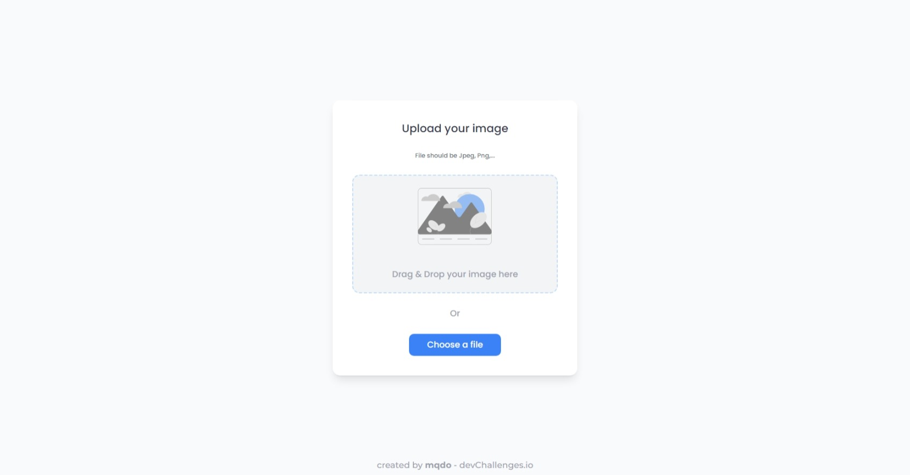

<h1 align="center">Image Uploader</h1>

<div align="center">
   Solution for a challenge from  <a href="http://devchallenges.io" target="_blank">Devchallenges.io</a>.
</div>

<div align="center">
  <h3>
    <a href="https://mqdo-image-uploader.netlify.app/">
      Demo
    </a>
    <span> | </span>
    <a href="https://github.com/mqdo/image-uploader">
      Solution
    </a>
    <span> | </span>
    <a href="https://devchallenges.io/challenges/O2iGT9yBd6xZBrOcVirx">
      Challenge
    </a>
  </h3>
</div>

<!-- TABLE OF CONTENTS -->

## Table of Contents

- [Overview](#overview)
  - [Built With](#built-with)
- [Features](#features)
- [How to use](#how-to-use)
- [Contact](#contact)
- [Acknowledgements](#acknowledgements)

<!-- OVERVIEW -->

## Overview



For more information please checkout [the demo](https://mqdo-image-uploader.netlify.app/)

### Built With

- [React](https://reactjs.org/)
- [Tailwind](https://tailwindcss.com/)
- [Node.js](https://nodejs.org/)
- [Express.js](https://expressjs.com/)

## Features

This application/site was created as a submission to a [DevChallenges](https://devchallenges.io/challenges) challenge. The [challenge](https://devchallenges.io/challenges/O2iGT9yBd6xZBrOcVirx) was to build an application to complete the given user stories.

## How To Use

To clone and run this application, you'll need [Git](https://git-scm.com) and [Node.js](https://nodejs.org/en/download/) (which comes with [npm](http://npmjs.com)) installed on your computer. From your command line:

```bash
# Clone this repository
$ git clone https://github.com/your-user-name/your-project-name

# Change the directory
$ cd client

# or

$ cd server

# Install dependencies
$ npm install

# Run the app
$ npm start
```

## Acknowledgements

- [Axios](https://axios-http.com/)
- [React Copy-To-Clipboard](https://www.npmjs.com/package/react-copy-to-clipboard)
- [React Icons](https://nodejs.org/)
- [Multer](https://www.npmjs.com/package/multer/)
- [Mongoose](https://mongoosejs.com/)
- [W3School - Drag events](https://www.w3schools.com/Jsref/obj_dragevent.asp)
- [GeeksforGeeks - Upload and Retrieve Image on MongoDB using Mongoose](https://www.geeksforgeeks.org/upload-and-retrieve-image-on-mongodb-using-mongoose/)
- Other packages such as Dotenv, Cors,...
- The server was deployed on [Render](https://image-uploader-gkjd.onrender.com/) and client was deployed on [Netlify](https://mqdo-image-uploader.netlify.app/)

## Contact

- GitHub [@mqdo](https://github.com/mqdo/)
- Twitter [@mqdo_dev](https://twitter.com/mqdo_dev)
